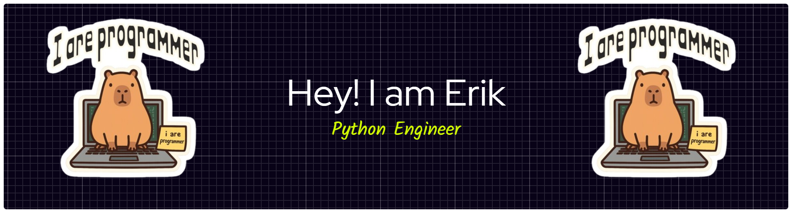

<h2 align="left">I am a Python Engineer from Armenia.</h2>

- 👨‍💻 Explore all of my projects on [GitHub](https://github.com/erik-nalbandyan?tab=repositories)

- 📄 Know about my experiences [CV]()</a>

- 🔭 Currently Searchin job as a Python Engineer Intern Level.

- 📫 How to reach me **erik.nalbandyan2005@gmail.com**

- 🎮🏆 Improving my coding skills with [CodeInGame](https://www.codingame.com/profile/ff307352ae5887ab5d31c0ee211b90a64527735)

- 🌱 Actively expanding my knowledge in **Python Core**, **Working with API**, **Telegram BOT Knowledge**

- 💬 Feel free to ask me about **Python, HTML, CSS**

---

<h1 align="left">Connect with me:</h1>

